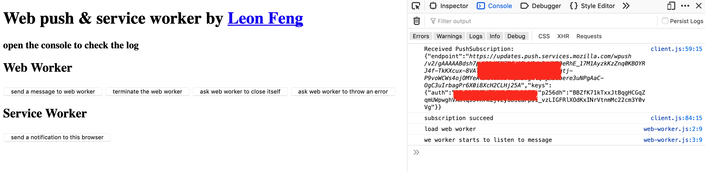

# web_api_worker
Demonstration of worker, service worker, web push and notification



## install
```shell
npm i
```

## try
```shell
npm start
```
go to `localhost:5000`

## use new vapid keys
```shell
npm install -g web-push
web-push generate-vapid-keys
```
update key in frontend and backend
